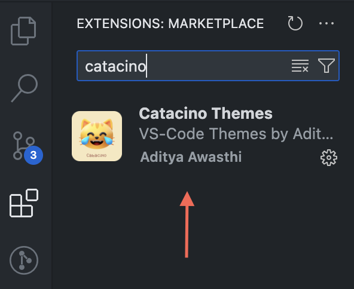
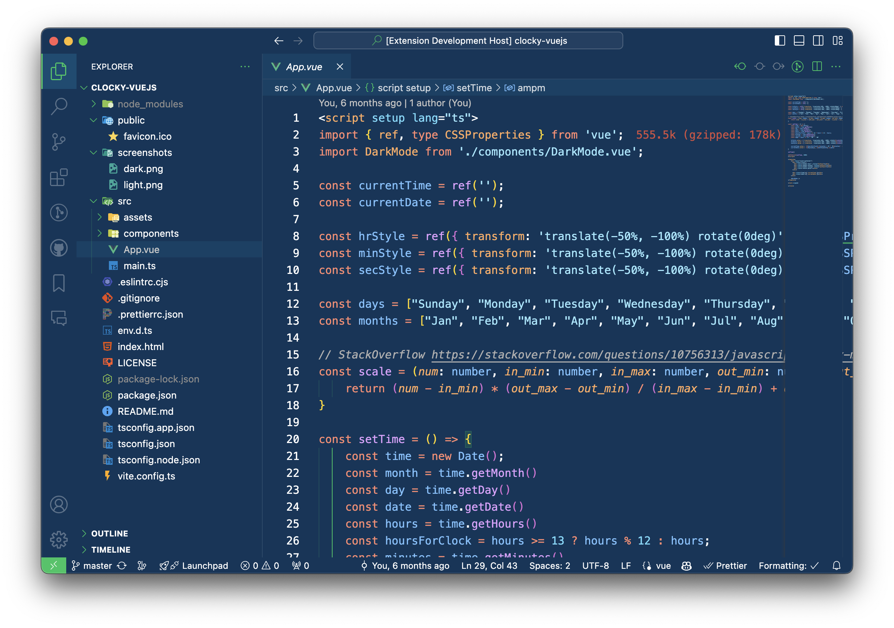
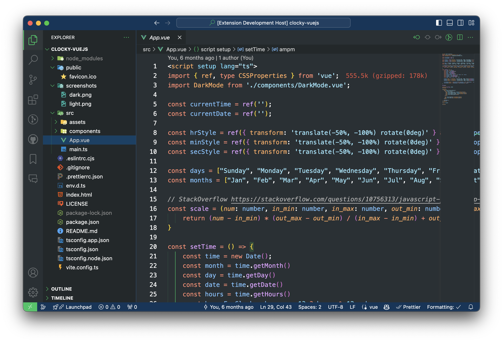
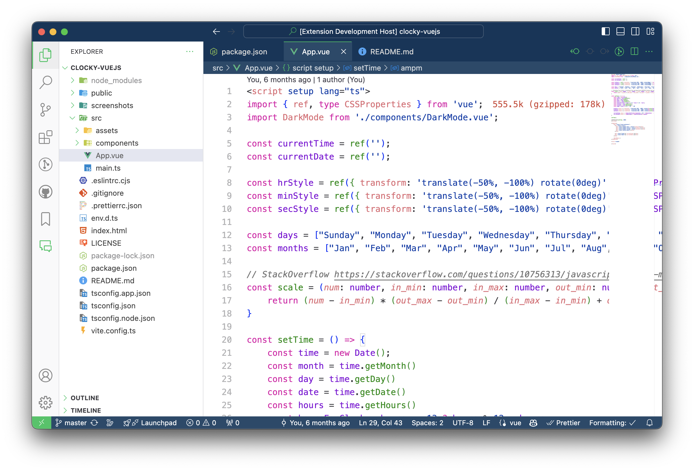

#  Themes for VS Code.

## Installation

1. Open **Extensions** sidebar panel in VS Code. `View → Extensions`
2. Search for **`catacino`** and look for the item below.
 - 
3. Click **Install** to install it.
4. Code > Preferences > Color Theme > **Aspire Core** | **Aspire Dark** etc.

The themes are available for editors; shells, UI, more themes coming soon.

## Available Themes

- Aspire Core

- Aspire Dark

- Aspire Light

Catacino Themes created by [Aditya Awasthi](https://github.com/adwardstark).