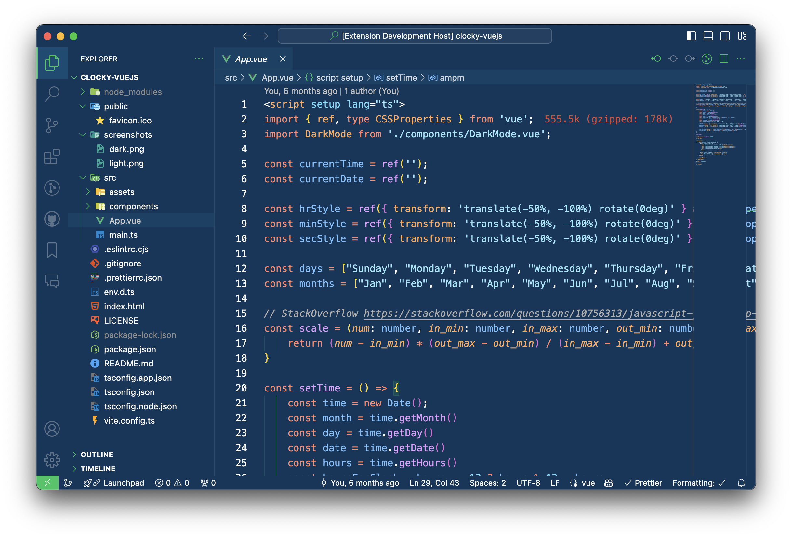

# Themes for VS Code.

 

# Installation

1. Open **Extensions** sidebar panel in VS Code. `View → Extensions`
2. Search for **`catacino`** and look for the above icon.
3. Click **Install** to install it.
4. Code > Preferences > Color Theme >
 **Aspire Core**

The theme is available for editors; shells, UI's and more coming soon.

## Available Options

- Aspire Core

### Screenshots

Catacino Themes created by [Aditya Awasthi](https://github.com/adwardstark).